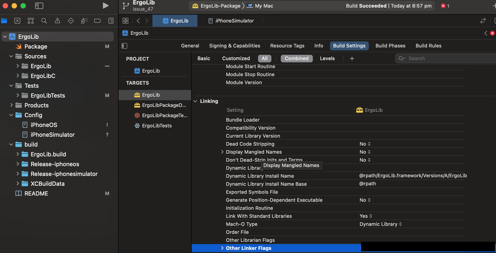
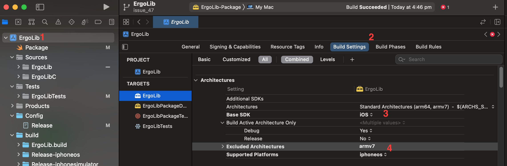

# Swift wrapper for [C bindings](../ergo-lib-c) of ergo-lib.

## Build instructions

### Prerequisites

- Xcode 15 or newer
- Rust toolchain (`stable` for builds, `nightly` only for `cbindgen`)
- Installed iOS targets (use only what you need):

```shell
rustup target add x86_64-apple-ios
rustup target add aarch64-apple-ios
rustup target add aarch64-apple-ios-sim
```

### 1. Build `ergo-lib-c`

From the `sigma-rust` repository root, build one or more targets:

```shell
cargo build --release --features rest --features mnemonic_gen -p ergo-lib-c
cargo build --release --target x86_64-apple-ios -p ergo-lib-c
cargo build --release --target aarch64-apple-ios -p ergo-lib-c
cargo build --release --target aarch64-apple-ios-sim -p ergo-lib-c
```

Library locations:

- Host build: `target/release/libergo.a`
- Intel simulator: `target/x86_64-apple-ios/release/libergo.a`
- Apple Silicon simulator: `target/aarch64-apple-ios-sim/release/libergo.a`
- iPhone device: `target/aarch64-apple-ios/release/libergo.a`

### 2. Generate C headers

`cbindgen` requires nightly just for header generation:

```shell
cd bindings/ergo-lib-c
rustup override set nightly
cbindgen --config cbindgen.toml --crate ergo-lib-c --output h/ergo_lib.h
rustup override set stable
```

### 3. Build and test the Swift package

```shell
cd ../ergo-lib-ios
swift build -Xlinker -L../../target/release/
swift test -Xlinker -L../../target/release/ --skip RestNodeApiTests --skip RestNodeApiIntegrationTests
```

`RestNodeApiTests` assumes an Ergo node is running on localhost.

## Xcode 15+

Open `bindings/ergo-lib-ios/Package.swift` in Xcode and pick the matching target configuration below.

### iPhone Simulator (Apple Silicon)

```shell
cd bindings/ergo-lib-ios
xcodebuild -scheme ErgoLib -configuration Release -xcconfig ./Config/iPhoneSimulator_arm.xcconfig -sdk iphonesimulator
```

### iPhone Simulator (Intel)

```shell
cd bindings/ergo-lib-ios
xcodebuild -scheme ErgoLib -configuration Release -xcconfig ./Config/iPhoneSimulator_intel.xcconfig -sdk iphonesimulator
```

### iPhone (iOS device)

```shell
cd bindings/ergo-lib-ios
xcodebuild -scheme ErgoLib -configuration Release -xcconfig ./Config/iPhoneOS.xcconfig -sdk iphoneos
```

If you customize paths, ensure linker flags point to the matching `target/<triple>/release` directory.



